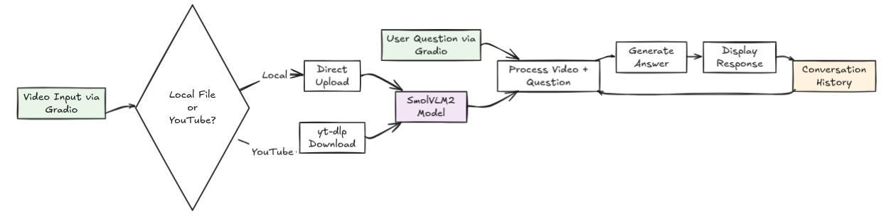

# 🎥 Video Chat with SmolVLM2-2.2B-Instruct

## Problem Statement
With the rapid advancement of Vision-Language Models (VLMs), there has been significant progress in developing AI systems that can understand and interpret video content alongside natural language queries. However, existing video understanding solutions require expensive API access or paid cloud services, creating barriers for users and raising data privacy concerns when analyzing personal video content. There's a need for a **local, privacy-focused solution** that can understand and answer questions about video content without relying on external services.

## Proposed Solution
We developed a **locally-running video chat application** that allows users to upload video files and ask natural language questions about the content. The system uses SmolVLM2-2.2B-Instruct for video understanding, runs entirely on local hardware, and provides complete data privacy while eliminating API dependencies.

## Architecture & Data Flow


**Data Flow:**
1. **Input**: User uploads video file
2. **Processing**: Video is processed locally using SmolVLM2 model
3. **Chat Interface**: Gradio provides interactive web interface
4. **Response**: AI generates answers based on video content analysis
5. **Context**: Conversation history maintained for follow-up questions

## Tools Used
| Tool | Purpose | Team Member |
|------|---------|-------------|
| **Google Colab** | Development environment and model testing | Arun Madhusudhanan |
| **Gradio Library** | Web interface and user interaction | Tejaswini Dilip Deore |
| **Hugging Face Transformers** | Model download and inference engine | Arun Madhusudhanan |

## Features
- 🔒 **Complete Privacy**: Runs entirely locally with no external API calls
- 📁 **Local Video Upload**: Upload video files from your device
- 💬 **Interactive Chat**: Ask questions about video content in natural language
- 🧠 **Context Awareness**: Maintains conversation history
- ⚡ **Lightweight**: Uses efficient SmolVLM2-2.2B-Instruct model

## Installation
*Need a 16GB GPU to run the VLM model faster. Tested using T4 GPU (free Colab version).*

```bash
# Clone the repository
git clone https://github.com/arunmadhusud/AskVid
cd AskVid

# Install dependencies
pip install -r requirements.txt

# Run the application
python app.py

# Access the interface
# Navigate to the generated URL for Gradio interface
```

## Usage
1. **Video Setup**: Upload a video file using the file uploader
2. **Load Video**: Click "Load Video" to process your content
3. **Ask Questions**: Type questions about the video content
4. **Get Answers**: AI analyzes video and provides responses
5. **Continue Chat**: Ask follow-up questions with maintained context

## Example Questions
- "What is the main topic of this video?"
- "Summarize the key points discussed"
- "What objects can you see in the video?"
- "Describe the actions taking place"